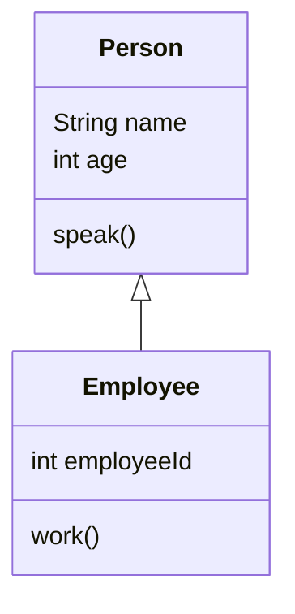
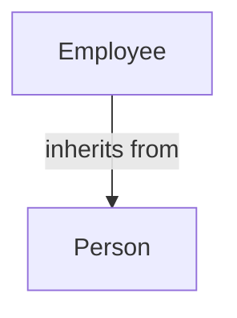
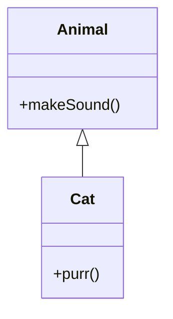
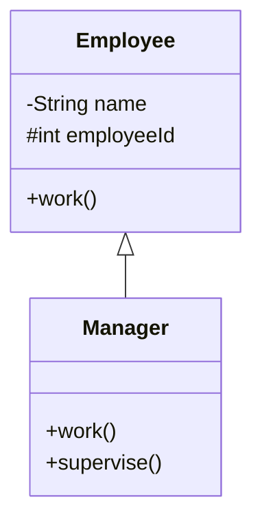
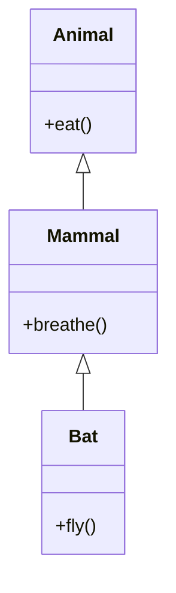
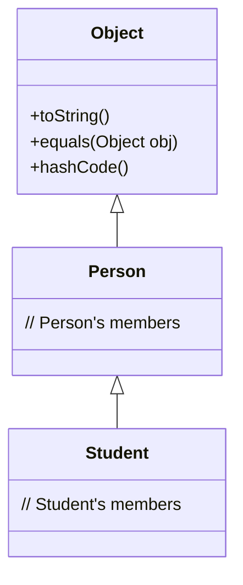
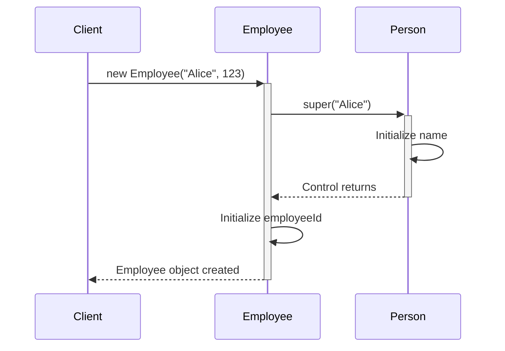

# Java Inheritance Lab

## Table of Contents
- [Definition and Basics of Inheritance](#1-definition-and-basics-of-inheritance)
- [Terminology](#2-terminology)
- [Implementing Inheritance in Java](#3-implementing-inheritance-in-java)
- [Subclass Capabilities](#4-subclass-capabilities)
- [Types of Inheritance](#5-types-of-inheritance)
- [The Object Class](#6-the-object-class)
- [Constructors in Inheritance](#7-constructors-in-inheritance)

## Lab Setup
1. Create a package called `ie.atu.inheritance`.
2. Create a `Main` class inside this package.
3. Place all the below classes from the DIY sections into this package.

## 1. Definition and Basics of Inheritance

### Learning Objective
Understand the concept of inheritance in Java, how it is implemented and how it allows one class to acquire the properties and behaviors of another class.

### Explanation
Inheritance is a fundamental principle in object-oriented programming (OOP) that allows a new class (subclass) to inherit properties and methods from an existing class (superclass). This promotes code reusability and logical organisation of classes. The subclass inherits characteristics (fields and methods) from the superclass, allowing you to create specialized classes based on more general ones.

An **"Is-A"** relationship is established between the subclass and superclass. For example, an Employee is a Person; hence, Employee can inherit from Person.

### Example
```java
public class Person {
    protected String name;
    protected int age;

    public void speak() {
        System.out.println("Hello, my name is " + name);
    }
}

public class Employee extends Person {
    public int employeeId;

    public void work() {
        System.out.println(name + " is working.");
    }
}
```

### Visual Representation


### DIY Exercise: Animals
1. Create a Animal class and a Dog class:

**Animal has:**
- Private field species (String)
- Method eat() that prints "The [species] is eating."

**Dog extends Animal:**
- Constructor that sets species to "Dog"
- Method bark() that prints "The dog barks."

In your Main class:
- Create an instance of Dog
- Call the eat() method
- Call the bark() method

## 2. Terminology

### Learning Objective
Familiarize yourself with key terms in inheritance, such as superclass and subclass, and understand their roles.

### Explanation
- **Superclass (Parent Class):** The class from which properties and methods are inherited. It represents a general concept.
- **Subclass (Child Class):** The class that inherits from the superclass. It represents a specialized version of the superclass.

Inheritance establishes a hierarchy between classes, where the subclass extends the functionality of the superclass.

### Visual Representation


### DIY Exercise: Vehicles
1. **Superclass:** Create a class Vehicle with a method move() that prints "The vehicle is moving."
2. **Subclass:** Create a class Car that extends Vehicle and adds a method playRadio() that prints "Playing radio."

In your Main class:
- Create an instance of Car
- Call move() and playRadio()

## 3. Implementing Inheritance in Java

### Learning Objective
Learn how to implement inheritance in Java using the extends keyword.

### Explanation
In Java, inheritance is implemented using the `extends` keyword. The syntax is:

```java
public class Subclass extends Superclass {
    // class body
}
```

### Example
```java
public class Animal {
    public void makeSound() {
        System.out.println("Some generic animal sound");
    }
}

public class Cat extends Animal {
    public void purr() {
        System.out.println("The cat purrs.");
    }
}
```

### Visual Representation


### DIY Exercise: Shapes
1. Create a superclass Shape with a method draw() that prints "Drawing a shape."
2. Create a subclass Circle that extends Shape and overrides draw() to print "Drawing a circle."

In your Main class:
- Create instances of Shape and Circle
- Call draw() on both instances

## 4. Subclass Capabilities

### Learning Objective
Understand what a subclass inherits and how it can override methods, including access to public and protected members, and limitations with private members.

### Explanation
A subclass inherits:
- **Public Members:** Accessible anywhere.
- **Protected Members:** Accessible in the same package or through inheritance in other packages.

A subclass cannot access:
- **Private Members:** Accessible only within the class they are declared.

Subclasses can:
- Override Methods: Provide a new implementation for an inherited method.
- Access Superclass Methods: Using the super keyword.

### Example
```java
public class Employee {
    private String name;
    protected int employeeId;

    public void work() {
        System.out.println("Employee is working.");
    }
}

public class Manager extends Employee {
    public void work() {
        System.out.println("Manager is working.");
    }

    public void supervise() {
        System.out.println("Manager is supervising.");
    }
}
```

### Visual Representation


### DIY Exercise: Literature
**Superclass: Book**
- Private field title (String)
- Protected field author (String)
- Public method read() that prints "Reading [title] by [author]."

**Subclass: EBook**
- Overrides read() to print "Reading [title] by [author] on a digital device."
- Adds a method download() that prints "Downloading [title]."

In your Main class:
- Create an instance of EBook
- Call read() and download()

## 5. Types of Inheritance

### Learning Objective
Explore different types of inheritance and understand Java's inheritance model.

### Explanation
Types of Inheritance:
1. Single Inheritance
2. Multilevel Inheritance
3. Hierarchical Inheritance
4. Hybrid Inheritance (Not supported with classes in Java)
5. Multiple Inheritance (Not supported with classes in Java)

### Example
```java
// Multilevel Inheritance
public class Animal {
    public void eat() {
        System.out.println("Animal eats.");
    }
}

public class Mammal extends Animal {
    public void breathe() {
        System.out.println("Mammal breathes air.");
    }
}

public class Bat extends Mammal {
    public void fly() {
        System.out.println("Bat is flying.");
    }
}
```

### Visual Representation


## 6. The Object Class

### Learning Objective
Understand that Object is the root superclass of all classes in Java and its significance in the class hierarchy.

### Visual Representation


### DIY Exercise: Implicit Inheritance
Create a class Gadget:
- Do not specify a superclass
- Override the toString() method to return "This is a gadget."

## 7. Constructors in Inheritance

### Learning Objective
Learn how constructors are used in inheritance, including how to invoke superclass constructors using the super keyword.

### Example
```java
public class Person {
    protected String name;

    public Person(String name) {
        this.name = name;
    }
}

public class Employee extends Person {
    private int employeeId;

    public Employee(String name, int employeeId) {
        super(name); // Call superclass constructor
        this.employeeId = employeeId;
    }
}
```

### Visual Representation


## Summary
- Definition and Basics of Inheritance
- Terminology
- Implementing Inheritance in Java
- Subclass Capabilities
- Types of Inheritance
- The Object Class
- Constructors in Inheritance

## Further Reading
- Java Documentation: Inheritance
- Book: Effective Java by Joshua Bloch
- Book: Java: A Beginner's Guide by Herbert Schildt
- Online Resource: Inheritance in Java - GeeksforGeeks

Happy coding! Remember to test your classes and understand how inheritance affects the behavior and structure of your objects.
