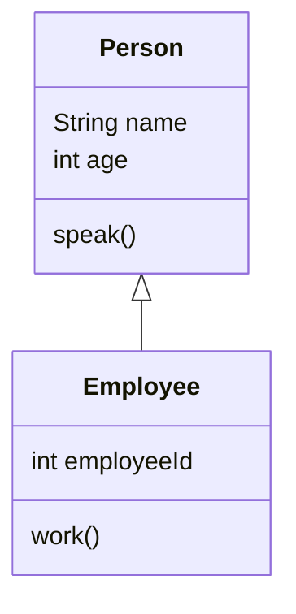
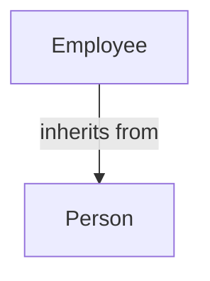
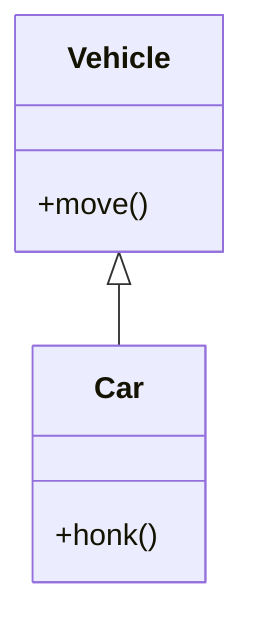
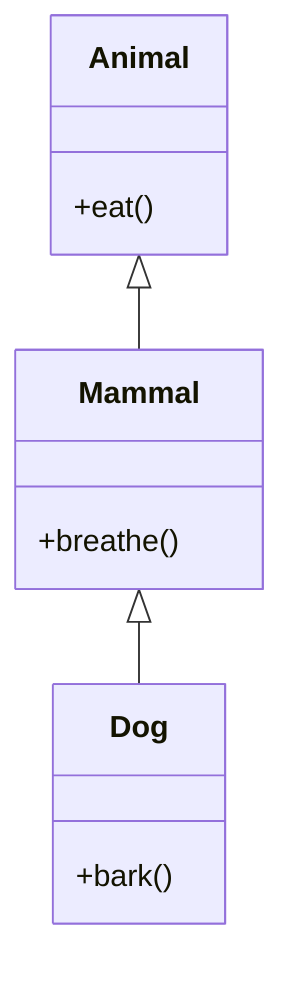
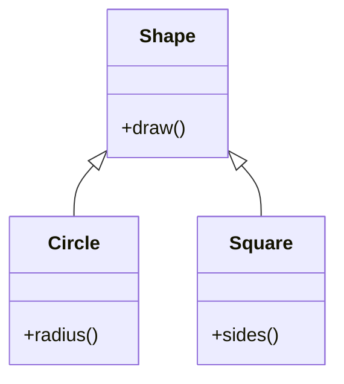
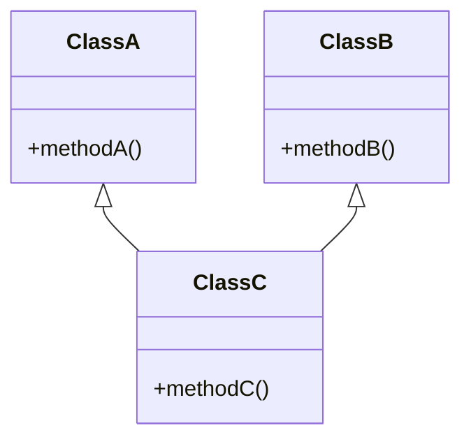
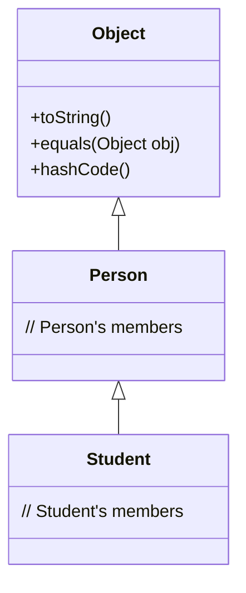
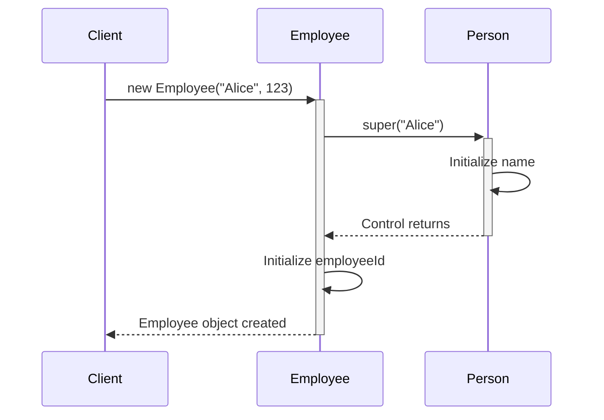

[](https://classroom.github.com/open-in-codespaces?assignment_repo_id=19174849)
# Inheritance Lab

## Table of Contents
1. [Definition and Basics of Inheritance](#1-definition-and-basics-of-inheritance)
2. [Terminology](#2-terminology)
3. [Types of Inheritance](#3-types-of-inheritance)
4. [The Object Class](#4-the-object-class)
5. [Constructors in Inheritance](#5-constructors-in-inheritance)

## Lab Setup
1. Create a package called `ie.atu.inheritance`.
2. Create a `Main` class inside this package.
3. Place all the below classes from the DIY sections into this package.

## 1. Definition and Basics of Inheritance

### Learning Objective
Understand the concept of inheritance in Java, how it is implemented and how it allows one class to acquire the properties and behaviors of another class.

### Explanation
Inheritance is a fundamental principle in object-oriented programming (OOP) that allows a new class (subclass) to inherit properties and methods from an existing class (superclass). This promotes code reusability and logical organisation of classes. The subclass inherits characteristics (fields and methods) from the superclass, allowing you to create specialized classes based on more general ones.

An **"Is-A"** relationship is established between the subclass and superclass. For example, an Employee is a Person; hence, Employee can inherit from Person.

### Example
```java
public class Person {
    protected String name;
    protected int age;

    public void speak() {
        System.out.println("Hello, my name is " + name);
    }
}

public class Employee extends Person {
    public int employeeId;

    public void work() {
        System.out.println(name + " is working.");
    }
}
```

### Visual Representation


### DIY Exercise: Animals
1. Create a Animal class and a Dog class:

**Animal has:**
- Private field species (String)
- Method eat() that prints "The [species] is eating."

**Dog extends Animal:**
- Constructor that sets species to "Dog"
- Method bark() that prints "The dog barks."

In your Main class:
- Create an instance of Dog
- Call the eat() method
- Call the bark() method

## 2. Terminology

### Learning Objective
Familiarize yourself with key terms in inheritance, such as superclass and subclass, and understand their roles.

### Explanation
- **Superclass (Parent Class):** The class from which properties and methods are inherited. It represents a general concept.
- **Subclass (Child Class):** The class that inherits from the superclass. It represents a specialized version of the superclass.

Inheritance establishes a hierarchy between classes, where the subclass extends the functionality of the superclass.

### Visual Representation


### DIY Exercise: Vehicles
1. **Superclass:** Create a class Vehicle with a method move() that prints "The vehicle is moving."
2. **Subclass:** Create a class Car that extends Vehicle and adds a method playRadio() that prints "Playing radio."

In your Main class:
- Create an instance of Car
- Call move() and playRadio()

## 3. Types of Inheritance

### Learning Objective
Explore different types of inheritance and understand Java's inheritance model.

### Explanation and Examples

#### 1. Single Inheritance
One class inherits from one superclass.

```java
public class Vehicle {
    public void move() {
        System.out.println("Vehicle moves");
    }
}

public class Car extends Vehicle {
    public void honk() {
        System.out.println("Car honks");
    }
}
```



#### 2. Multilevel Inheritance
Chain of inheritance where subclass becomes superclass for another class.

```java
public class Animal {
    public void eat() {
        System.out.println("Animal eats");
    }
}

public class Mammal extends Animal {
    public void breathe() {
        System.out.println("Mammal breathes");
    }
}

public class Dog extends Mammal {
    public void bark() {
        System.out.println("Dog barks");
    }
}
```



#### 3. Hierarchical Inheritance
Multiple classes inherit from one superclass.

```java
public class Shape {
    public void draw() {
        System.out.println("Drawing shape");
    }
}

public class Circle extends Shape {
    public void radius() {
        System.out.println("Has radius");
    }
}

public class Square extends Shape {
    public void sides() {
        System.out.println("Has four sides");
    }
}
```



#### 4. Multiple Inheritance (Not Supported in Java)
One class inheriting from multiple superclasses.



Java doesn't support multiple inheritance with classes to avoid:
1. Ambiguity when same method exists in multiple parent classes
2. Complexity in method resolution
3. Potential naming conflicts

Instead, Java provides interfaces for implementing multiple inheritance of behavior.

## 4. The Object Class

### Learning Objective
Understand that Object is the root superclass of all classes in Java and its significance in the class hierarchy.

### Visual Representation


### DIY Exercise: Implicit Inheritance
Create a class Gadget:
- Do not specify a superclass
- Override the toString() method to return "This is a gadget."

## 5. Constructors in Inheritance

### Learning Objective
Learn how constructors are used in inheritance, including how to invoke superclass constructors using the ``super`` keyword.

### Explanation

In Java inheritance, constructors play a crucial role in object initialization. When you create an instance of a subclass:

1. The superclass constructor must be called first before the subclass constructor executes
2. If not explicitly called, Java automatically calls the no-argument constructor of the superclass
3. Use the super() keyword to call a specific superclass constructor
4. The super() call must be the first statement in the subclass constructor

Key points to remember:

- Every constructor must invoke a constructor from its superclass, either explicitly or implicitly
- If the superclass doesn't have a no-argument constructor, the subclass must explicitly call a superclass constructor using super()
- The super keyword can also be used to access superclass methods and fields

### Example  
```java
public class Person {
    protected String name;

    public Person(String name) {
        this.name = name;
    }
}

public class Employee extends Person {
    private int employeeId;

    public Employee(String name, int employeeId) {
        super(name); // Call superclass constructor
        this.employeeId = employeeId;
    }
}
```

### Visual Representation


### DIY Exercise: School Management
1. Create a Person class with:
   - Private fields: name (String) and age (int)
   - Constructor that initializes both fields
   - Create getters and setters

2. Create a Student class that extends Person with:
   - Private field: studentId (String)
   - Constructor that initializes name, age, and studentId
   - Create getters and setters
   
In your Main class:
- Create instances of both Person and Student
- Print the details of both using print statements and the getters and setters.

## Summary
- Definition and Basics of Inheritance
- Terminology
- Types of Inheritance
- The Object Class
- Constructors in Inheritance

## Further Reading
- Java Documentation: Inheritance
- Book: Effective Java by Joshua Bloch
- Book: Java: A Beginner's Guide by Herbert Schildt
- Online Resource: Inheritance in Java - GeeksforGeeks

Happy coding! Remember to test your classes and understand how inheritance affects the behavior and structure of your objects.
